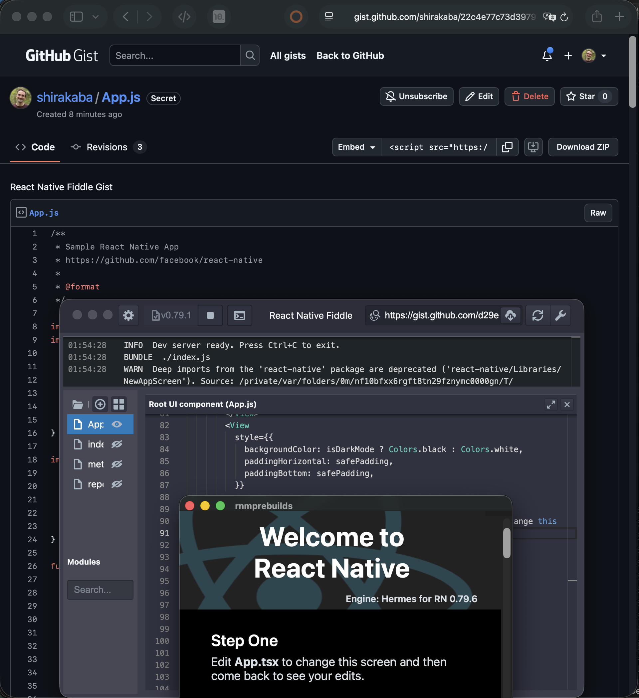

# React Native Fiddle

React Native Fiddle lets you create and play with small React Native Desktop
experiments. It greets you with a quick-start template after opening – change a
few things, choose the version of React Native Desktop you want to run it with,
and play around. Then, save your Fiddle either as a GitHub Gist or to a local
folder. Once published on GitHub, anyone can quickly try your Fiddle out by just
entering it in the address bar.

## Getting started

Until we have distributed our first release build (don't worry, we plan to do
this as soon as possible), React Native Fiddle only works via development mode.

```sh
# Clone the repo:
git clone git@github.com:shirakaba/react-native-fiddle.git
cd react-native-fiddle

# Install the npm dependencies…
yarn install

# … Run React Native Fiddle!
yarn start
```

## Features

### Explore React Native Desktop



Try React Native Desktop without installing any dependencies: Fiddle includes
everything you'll need to explore the platform.

### Excellent editing

Fiddle includes Microsoft's excellent Monaco Editor, the same editor powering
Visual Studio Code!

## Contributing

React Native Fiddle is a community-driven project that welcomes all sorts of contributions. Please check out our [Contributing Guide](https://github.com/electron/fiddle/blob/main/CONTRIBUTING.md) for more details.

## Related projects

- [react-native-fiddle-repro](https://github.com/shirakaba/react-native-fiddle-repro): The project template that React Native Fiddle app clones.
- [rnmprebuilds](https://github.com/shirakaba/rnmprebuilds): The repository for building and hosting prebuilds of `React Native.app`.

## License

[MIT, please see the LICENSE file for full details](https://github.com/shirakaba/react-native-fiddle/blob/main/LICENSE.md).
